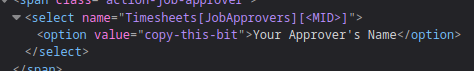

# Astute Payroll Timesheet Submitter

A Python script to submit your Astute Payroll timesheet automatically.

Note: this script is currently untested on Windows, so let me know how it goes.

## Quick Start

You'll need [Git](https://git-scm.com/downloads) and [Python 3](https://www.python.org/downloads/) installed, then:

```console
$ git clone https://github.com/maxcutlyp/astutepayrollsubmitter
$ cd astutepayrollsubmitter
$ python3 setup.py
$ # ...
$ python3 submit_timesheet.py
```

## setup.py

Here's some extra information about the `setup.py` prompts:

- `The URL of your astutepayroll login page` - where you enter your username and password. For me, this was `https://<company>.astutepayroll.com/<company>/auth/login`
- `Your astutepayroll username` - the username you use to sign into the above page
- `A command that sends your astutepayroll password to stdout` - if you have a password manager with a CLI (such as [pass](https://www.passwordstore.org/)), enter the command you use to show that password. Otherwise you can leave it blank and `submit_timesheet.py` will prompt for your password when you run it.
- `Go to one of your timesheets and paste its URL` - any timesheet will do. Make sure the URL contains a part that says `MID=...` and `UID=...` (where `...` is some numbers). For me, this looked like `https://<company>.astutepayroll.com/<company>/attendance/manage/?MID=<...>&UID=<...>&date=<...>`
- `Your approver's username` - the easiest way to find this is to look at the `value` attribute of the relevant `option` element. Go to any unsubmitted timesheet and click the Submit button, then right click on the "Selected Approver" dropdown box and click "Inspect element". You may need to expand the `select` element - see below:  

- `Start time` and `finish time` - these should be in 12-hour time with a lowercase `am`/`pm`, e.g. `9:00am`, `5:00pm`, `12:00pm`, etc.
- `Break time` - in minutes. Currently only up to 120 minutes is supported because after that it starts using hours.

I've tried to cover all the bases here but I have a pretty limited sample size, so please open an issue if you notice anything missing or not working.

## Currently unsupported

Here's a list of features that have not yet been implemented. I am more than happy to review and merge pull requests (relating to these or not). Click to see details.

<details>
<summary>Working on weekends/not working 5 days a week</summary>

The way the script currently works is by replacing placeholder text in a template file (`post_body`), like `<DATE_MONDAY> -> 2001-01-01`. However, it seems like astutepayroll only adds the relevant fields for a day if there's a time entry there, i.e. instead of "on Saturday we started at blank and ended at blank with a break time of blank etc" it says "on Saturday there was no time entry" and leaves out all the otherwise-empty details. To add support for working any days other than Monday-Friday, we would need to slightly refactor how the template file is structured and how the script interacts with it. It would likely involve a single-day template which is only inserted for days that have time entries. I haven't implemented this because I haven't had a need for it, but I'm open to working on it with anyone who'd like to give it a shot.
</details>

<details>
<summary>Input validation for setup.py</summary>

Specifically around time entries. This would be an easy PR if you're looking to boost your stats, I just haven't got around to it yet.
</details>

<details>
<summary>Success/error messages</summary>

Since the responses are just HTML, it's not trivial to parse them consistently for plaintext output. For now, you'll just have to check manually by logging into the web portal the first time until you trust that it works.
</details>

<details>
<summary>Modifying env.py</summary>

Either with `setup.py` to update an existing `env.py` if one exists, or with command-line arguments e.g. `--monday-start "9:30am"`. I'll probably do this the next time I have a non-standard time entry, but in the meantime you can just manually modify `env.py` (or re-run `setup.py` if it's a big change).
</details>

